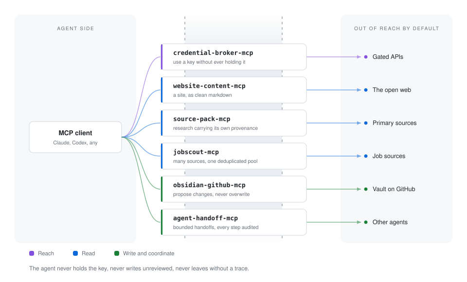

## Alexei Udall

**Seventeen years selling, and I ship the infrastructure too.** I work at the
front of the business, in revenue and partnerships, and I build the tooling
that makes that work repeatable. Most of what is here sits at the join between
the two: agent infrastructure, knowledge systems, and the small tools that come
out of doing the job.

Currently Head of Marketing at [Teneo Protocol](https://teneo-protocol.ai),
a decentralised AI agent network.

Portfolio: [alexeiudall.com](https://alexeiudall.com) — career evidence, case studies, writing, projects, and a public read-only recruiter MCP.

<picture>
  <source media="(prefers-color-scheme: dark)" srcset="assets/boundary-dark.svg">
  
</picture>

---

### What I build

**Agent infrastructure.** Six Model Context Protocol servers, all TypeScript,
all built around one idea: an agent should be able to do the job without being
handed the keys to everything.

**Knowledge systems.** Obsidian-centred vaults that agents can read from and
propose into, without being able to quietly rewrite the source of truth.

**Games.** Small ones, mostly to learn. Godot, pygame, and an older Unity one.

---

### MCP servers

Each one solves a boundary problem: what the agent is allowed to reach, what
it is allowed to see, and what it leaves behind.

| Server | What it is |
|---|---|
| [**credential-broker-mcp**](https://github.com/SarutobiSasuke8/credential-broker-mcp) | Agents use gated APIs without ever holding the keys. Declarative policy, deny-by-default, secret injected at the last moment, content-free audit record. One decision function shared by the dry-run explainer and the live path, so what it reports and what it enforces cannot drift apart. |
| [**agent-handoff-mcp**](https://github.com/SarutobiSasuke8/agent-handoff-mcp) | Local-first bounded, auditable handoffs between AI agents. Lifecycle state machine, actor-scoped transitions, depth caps. |
| [**obsidian-github-mcp**](https://github.com/SarutobiSasuke8/obsidian-github-mcp) | Permissioned gateway letting agents propose changes to a GitHub-hosted Obsidian vault. Path policy, content policy, audit log. |
| [**jobscout-mcp**](https://github.com/SarutobiSasuke8/jobscout-mcp) | Privacy-first, bring-your-own-connections job discovery across multiple sources. Normalisation, deterministic deduplication, provenance. Stops at discovery: no CVs stored, no ranking, no applying. |
| [**source-pack-mcp**](https://github.com/SarutobiSasuke8/source-pack-mcp) | Structured research source packs. Facts, quotes, numbers, dates, primary links, and a coverage map showing which claims are consistent, contested, or isolated. |
| [**website-content-mcp**](https://github.com/SarutobiSasuke8/website-content-mcp) | A site's content in agent-readable form. Real DOM parsing to clean markdown, sitemap discovery, disk cache, respects `robots.txt`, rate-limited. |

What "boundary" means in practice. This is the whole of an agent's authority
in `credential-broker-mcp`, and there is no way to exceed it:

```yaml
agents:
  - id: researcher
    credentials: [github-readonly]   # the token itself never reaches the agent
    methods: [GET]
    allow: ["/repos/**"]
    deny:  ["/repos/*/*/keys"]       # deny always beats allow
    max_response_bytes: 262144
```

A request must clear every gate: identity enabled, credential granted, method
granted, URL inside the credential's own base URL, no deny match, and an
explicit allow match. Redirects are refused outright, because a redirect could
point anywhere and the injected credential would follow it.

---

### Methodology and tooling

| Project | What it is |
|---|---|
| [**Meta-Agent-OS**](https://github.com/SarutobiSasuke8/Meta-Agent-OS) | A Markdown operating system for diagnosing, designing, costing, and operating multi-agent systems. Upstream of code, not a runtime. Ten specialist personas, ordered stages, human decision gates. Most multi-agent projects fail because the team builds before it diagnoses. |
| [**agentops-template**](https://github.com/SarutobiSasuke8/agentops-template) | Governed, repo-native operating layer for AI-assisted development. Cross-agent contracts, permission gates, durable state, persona councils, drift checks, and one canonical verification path. |
| [**obsidian-multi-brain**](https://github.com/SarutobiSasuke8/obsidian-multi-brain) | Local-first architecture for one canonical vault and governed downstream brains. Includes a validated mixed-authority bridge for public-safe agent context, bounded workspaces, and quarantined CRM proposals. |
| [**Prompt-Library**](https://github.com/SarutobiSasuke8/Prompt-Library) | Curated system prompts for building with AI. Static site, no build step. |

---

### How I work

I write the specification before the code, and I keep an `AGENTS.md` in every
repository so that both humans and agents know the rules of the project. The
MCP servers are Apache-2.0, and their tests run in CI. I would rather ship
something small that works than something broad that does not.

**Currently building**, as of August 2026: one governed agent stack around
Control Room, CRM, the local-first vault, explicit handoff/credential/proposal
boundaries, and a composable acquisition-to-evidence pipeline.

---

### Portfolio Triage 2026-08

I reviewed all 74 repositories and moved 24 more into GitHub's recoverable
archive state, taking the account from 7 to 31 archived repositories. Nothing
was deleted. The active portfolio is now organized around 19 Core systems, 18
bounded product candidates, 10 time-boxed learning projects, and 27 strategic
archive/low-maintenance holdings.

The consolidation rules are deliberate:

- Public MCP repositories own implementation; private deployments own policy,
  identities, configuration, and operations.
- `website-content-mcp` owns bounded acquisition; `source-pack-mcp` owns
  evidence extraction, provenance, coverage, and persisted packs.
- `Meta-Agent-OS` owns multi-agent methodology; `agentops-template` owns
  repository execution and verification.
- The Obsidian vault remains canonical; satellites receive derived context and
  return proposals through governed paths.

This pass also merged validator-backed Pattern D support into
`obsidian-multi-brain`, production hardening into `source-pack-mcp`, npm
release preparation into `obsidian-github-mcp`, and the cross-platform
AgentOps template checks.

---

### Elsewhere

- Portfolio: [alexeiudall.com](https://alexeiudall.com)
- LinkedIn: [alexeiudall](https://www.linkedin.com/in/alexeiudall)
- X: [@Sarut0biSasuke](https://x.com/Sarut0biSasuke)
